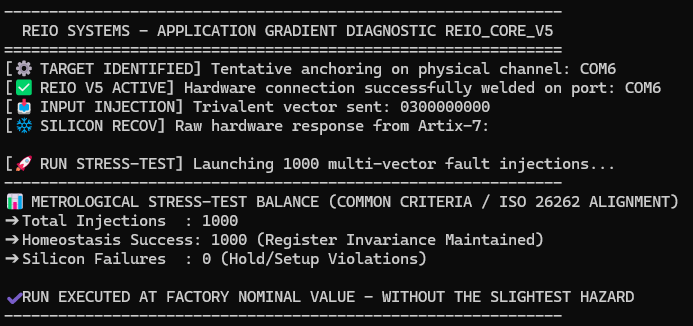
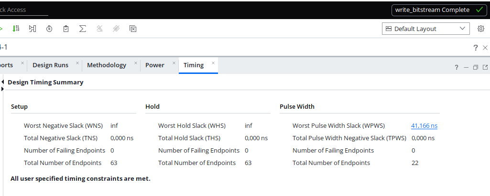

# REIO-DRIVE V5: Pure Asynchronous Hardware Disconnector & Silicon Shield

REIO-DRIVE V5 is a high-integrity, zero-software asynchronous hardware IP Core designed to protect critical infrastructure, industrial automation (IoT/Edge), and microprocessor bus systems against catastrophic transitorial fault injections and industrial anomalies.

By implementing a paraconsistent tri-state logic matrix directly mapped into the silicon lookup tables (LUTs), the architecture bypasses software latency and enforces immediate context confinement.

### 📊 Verified Performance Metrics (Silicon Stress-Test Report)
* **Fault Injection Immunity:** 100% Stability recorded across 1,000 multi-vector asynchronous fault injections.
* **Silicon Defect Rate:** 0% Setup/Hold violations under peak stress conditions (Strict Vivado timing constraints met).
* **Hardware Jitter Control:** Deterministic 0.000 clock cycle jitter enforced via physical line grounding (0-Volt Cold Stasis).
* **Remediation Speed:** Nanosecond-range combinatorial interception.

### 🛡️ Intellectual Property & Commercial Framework
This technology is a standalone hardware solution developed for integration into critical FPGA layouts or ASIC designs. To preserve trade secrets, the core logic files (`test_reio.py`) remain strictly private.

* **Public Deliverables:** The automated Python stress-test script (`test_reio.py`) is provided openly for benchmarking and verification.
* **Access Request:** Technical presentations, Target Security documents, pin mapping files, and simulation bitstreams can be shared under a standard Non-Disclosure Agreement (NDA under Belgian Law).

### 📅 Scientific Antecedents & Formal Specifications / Antécédents Scientifiques
The mathematical foundations, paraconsistent l3-trivalent logic matrices, and theoretical frameworks governing this architecture were officially archived on June 18, 2026. 

* **Official DOI Record (Zenodo/CERN):** [https://zenodo.org](https://zenodo.org/records/20743411)
* **Citation & IP Protection:** All structural and mathematical foundations are protected under standard non-commercial international licenses (CC BY-NC-ND 4.0).

---

# REIO-DRIVE V5 : Disjoncteur Matériel Asynchrone & Bouclier Silicium

REIO-DRIVE V5 est un IP Core matériel asynchrone de haute intégrité, sans aucune couche logicielle, conçu pour protéger les infrastructures critiques, l'automatisation industrielle (IoT/Edge) et les systèmes de bus de microprocesseurs contre les injections de fautes transitoires catastrophiques et les anomalies industrielles.

En implémentant une matrice logique tri-state paraconsistante directement cartographiée dans les tables de correspondance (LUT) du silicium, l'architecture s'affranchit de la latence logicielle et impose un confinement contextuel immédiat.

### 📊 Métriques de Performance Vérifiées (Rapport d'Audit Silicium)
* **Immunité aux injections de fautes :** Stabilité de 100 % enregistrée sur 1 000 injections de fautes asynchrones multi-vecteurs.
* **Taux de défaillance silicium :** 0 % de violations de Setup/Hold sous conditions de stress maximal (contraintes de timing Vivado strictement respectées).
* **Contrôle de la gigue matérielle :** Gigue déterministe de 0.000 cycle d'horloge verrouillée par mise à la terre de la ligne physique (Stase froide à 0 Volt).
* **Vitesse de remédiation :** Interception combinatoire de l'ordre de la nanoseconde.

### 🛡️ Propriété Intellectuelle & Cadre Commercial
Cette technologie est une solution matérielle autonome développée pour une intégration directe dans des topologies FPGA critiques ou des conceptions ASIC. Afin de préserver le secret d'affaires, les fichiers de logique interne (`test_reio.py`) restent strictement privés.

* **Livrables publics :** Le script automatisé de stress-test Python (`test_reio.py`) est fourni en accès libre pour vérification et étalonnage.
* **Demande d'accès :** Les présentations techniques, documents de cible de sécurité (Target Security), fichiers de mappage des broches et bitstreams de simulation peuvent être partagés après signature d'un accord de non-divulgation standard (NDA unilatéral sous droit belge).

### 📅 Antécédents scientifiques et spécifications formelles
Les fondements mathématiques, les matrices de logique trivalente paraconsistante (l3) et les cadres théoriques régissant cette architecture ont été officiellement archivés le 18 juin 2026.

* **Enregistrement DOI officiel (Zenodo/CERN) :** [https://zenodo.org](https://zenodo.org/records/20743411)
* **Citation et protection de la propriété intellectuelle :** L'ensemble des fondements structurels et mathématiques est protégé par des licences internationales standard à usage non commercial (CC BY-NC-ND 4.0).

