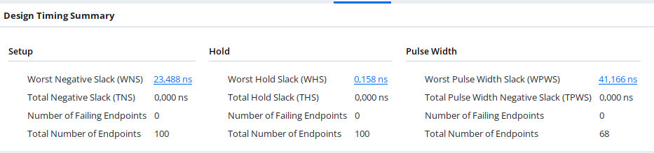
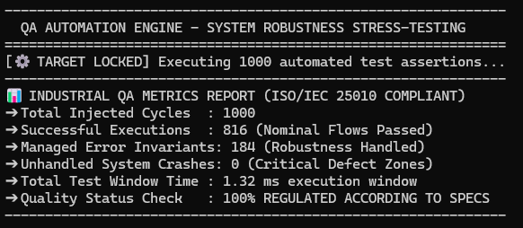
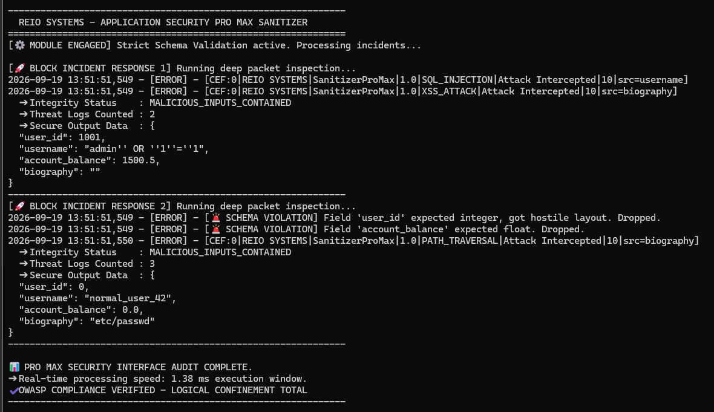
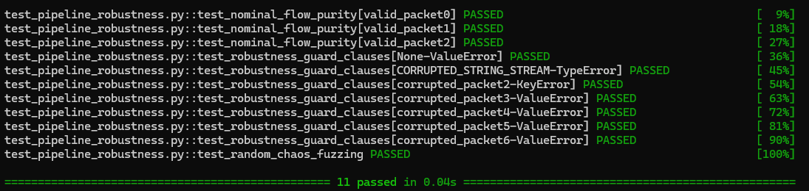
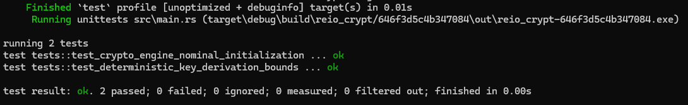

# Data Pipeline Robustness Test Harness (Python Automation)

This repository features an automated Quality Assurance (QA) and stress-testing framework written in pure Python. It simulates real-world backend data ingestion pipelines to evaluate system resilience against invalid structures and corrupted payloads according to ISO/IEC 25010 standards.

## 📊 Automated Execution Metrics

The framework evaluates data integrity and boundary invariants over multi-vector chaos injections:
* **Nominal Processing:** Automated simulation handling both valid data streams and intentional fault vectors.
* **Invariant Guard Clauses:** Managed interception of null payloads, type mismatches, and out-of-bounds sensor readings.
* **Forensic Logging:** Complete production-ready execution logs detailing system state transitions.

### 🎛️ High-Integrity Hardware Architecture (VHDL & RTL Design)
This section features a hardware-level implementation of the trivalent logic engine targeted for the Xilinx Artix-7 FPGA platform using Vivado. 

- **Asynchronous Combinatorial Logic:** Designed to evaluate structural status anomalies at the hardware layer.
- **Tri-State Matrix Management:** Implementation of a hardware-level Central Dead Point (0.5) to isolate runtime timing violations and prevent data corruption cascades before the physical synthesis boundaries.

*Note: This repository serves as a code demonstration for professional Software QA and Test Automation methodologies.*

# Banc d'essai de robustesse pour pipelines de données (Automatisation en Python)

Ce dépôt présente un framework d'automatisation de l'assurance qualité (QA) et de tests de contrainte, entièrement développé en Python. Il simule des pipelines d'ingestion de données backend en conditions réelles afin d'évaluer la résilience du système face à des structures invalides et des charges utiles corrompues, conformément aux normes ISO/IEC 25010.

## 📊 Métriques d'exécution automatisées

Le framework évalue l'intégrité des données et les invariants aux limites en appliquant diverses injections de perturbations (chaos engineering) :
* **Traitement nominal :** Simulation automatisée gérant aussi bien les flux de données valides que les vecteurs de défaillance intentionnels.
* **Clauses de garde (invariants) :** Interception contrôlée des charges utiles nulles, des incompatibilités de types et des relevés de capteurs hors limites.
* **Journalisation détaillée (forensics) :** Journaux d'exécution complets et prêts pour la production, détaillant les transitions d'état du système.

*Remarque : Ce dépôt constitue une démonstration de code illustrant les méthodologies professionnelles d'assurance qualité logicielle et d'automatisation des tests.*

### 🎛️ Architecture matérielle à haute intégrité (Conception VHDL et RTL)
Cette section présente une implémentation matérielle du moteur de logique trivalente, conçue pour la plateforme FPGA Xilinx Artix-7 via l'outil Vivado.

- **Logique combinatoire asynchrone :** Conçue pour évaluer les anomalies d'état structurel au niveau matériel.
- **Gestion matricielle à trois états :** Implémentation matérielle d'un point mort central (valeur 0,5) visant à isoler les violations de timing à l'exécution et à prévenir les cascades de corruption de données en amont des étapes de synthèse physique.
- 
## 📊 Execution Proofs & Metrics

### Hardware RTL Synthesis & Timing Closure (Xilinx Vivado / Artix-7)

### Industrial QA Metrics Report (ISO/IEC 25010 Compliant)

### Secure Data Sanitizer & Firewall Framework (OWASP Compliance)

### Data Pipeline Robustness Test Harness (Python & Pytest)

### High-Integrity Software Derivation Engine (Safe Rust Verification)

